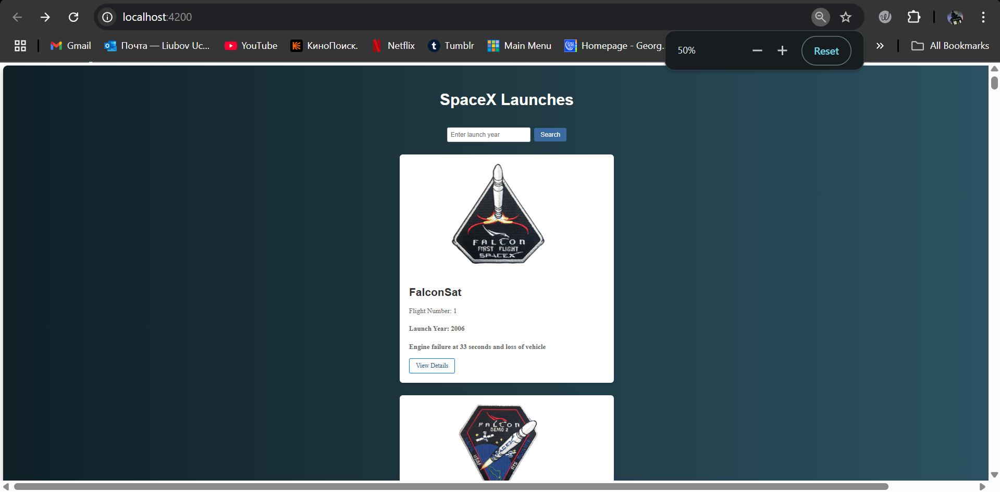
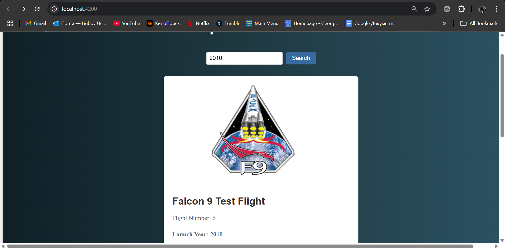
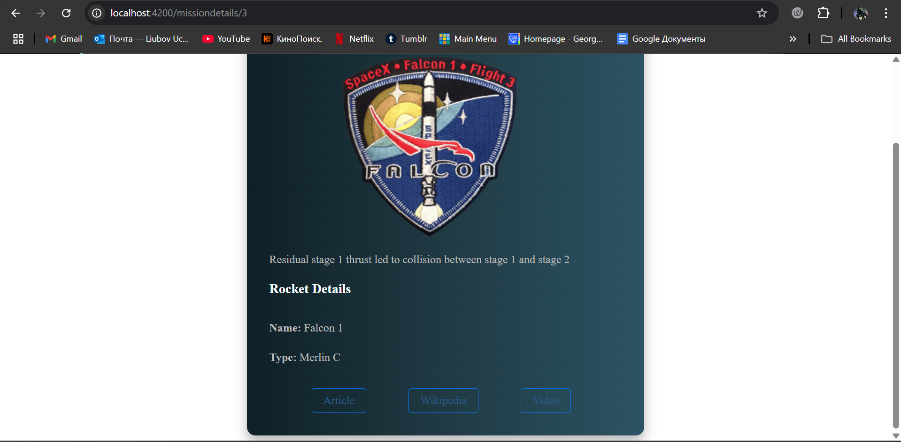

# SpaceX Mission Tracker

This is an Angular application that displays SpaceX mission details using the SpaceX API. The app allows users to filter missions based on launch year and view additional details for each mission.

## Features
- Fetch and display SpaceX mission data
- Filter missions by launch year
- View mission details including flight number, launch year, and mission patch

## Technologies Used
- **Angular** (Standalone Components)
- **TypeScript**
- **RxJS** for handling API requests
- **Custom CSS** for styling
- **SpaceX API** for fetching mission data
- **Vercel** for deployment

## Installation
1. Clone the repository:
   ```bash
   git clone https://github.com/LiubovUch/101445260-lab-test2-comp3133.git
   cd 101445260-lab-test2-comp3133
   ```

2. Install dependencies:
   ```bash
   npm install
   ```

3. Run the development server:
   ```bash
   ng serve
   ```
   The application will be available at `http://localhost:4200/`.

## Deployment
The project is deployed on Vercel. You can access it [here](https://101445260-lab-test2-comp3133.vercel.app/).


## API Endpoint
The application fetches data from the following SpaceX API:
```
https://api.spacexdata.com/v3/launches
```




